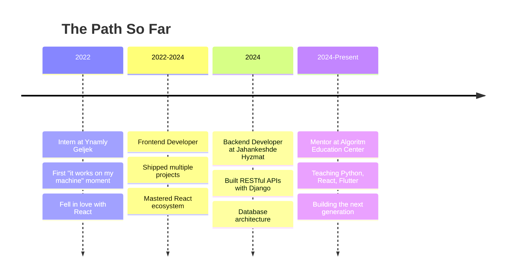

<div align="center">

<!-- HEADER WITH TYPING ANIMATION -->


<!-- TYPING SVG -->
[](https://git.io/typing-svg)

<!-- SOCIAL BADGES -->
[](https://github.com/TheSeydiCharyyev)
[](https://github.com/TheSeydiCharyyev?tab=followers)
[](https://github.com/TheSeydiCharyyev?tab=repositories)

</div>

<!-- ABOUT ME -->
##  &nbsp;About Me

```javascript
const seydi = {
    location: "Mary, Turkmenistan",
    role: "Fullstack Engineer & Mobile Developer",
    currentFocus: "Mentor at Algoritm Education Center",
    motto: "I just want to be successful enough to help people",

    skills: {
        languages: ["Python", "JavaScript", "TypeScript", "Dart", "Kotlin", "Swift"],
        frontend: ["React", "Next.js", "Vue", "Angular", "Svelte"],
        backend: ["Django", "FastAPI", "Node.js", "NestJS", "Spring Boot"],
        mobile: ["Flutter", "React Native"],
        databases: ["PostgreSQL", "MongoDB", "Redis", "Firebase"],
        devops: ["Docker", "Kubernetes", "AWS", "GCP", "CI/CD"]
    },

    languages: {
        turkmen: "Native",
        russian: "C1",
        english: "B2",
        german: "A2",
        french: "A2",
        chinese: "HSK2"
    },

    funFact: "Started with C++ and Delphi, now building the future with React and Flutter"
};
```

<!-- CURRENT FOCUS -->
##  &nbsp;What I'm Up To


- **Teaching** the next generation of developers at Algoritm Education Center
- **Building** a Chinese Language Learning App for Turkmenistan
- **Mastering** cloud architecture and DevOps practices
- **Contributing** to open source when I can
- **Learning** something new every single day

<br clear="right"/>

<!-- TROPHIES -->
##  &nbsp;GitHub Trophies

<div align="center">

[](https://github.com/ryo-ma/github-profile-trophy)

</div>

<!-- TECH STACK -->
##  &nbsp;Tech Stack

<details open>
<summary><b>Languages</b></summary>
<br>
<p align="center">
<a href="https://skillicons.dev">

</a>
</p>
</details>

<details open>
<summary><b>Frontend Development</b></summary>
<br>
<p align="center">
<a href="https://skillicons.dev">

</a>
</p>
</details>

<details open>
<summary><b>Backend Development</b></summary>
<br>
<p align="center">
<a href="https://skillicons.dev">

</a>
</p>
</details>

<details open>
<summary><b>Mobile Development</b></summary>
<br>
<p align="center">
<a href="https://skillicons.dev">

</a>
</p>
</details>

<details open>
<summary><b>Database & Cloud</b></summary>
<br>
<p align="center">
<a href="https://skillicons.dev">

</a>
</p>
</details>

<details open>
<summary><b>Tools & Workflow</b></summary>
<br>
<p align="center">
<a href="https://skillicons.dev">

</a>
</p>
</details>

<!-- GITHUB STATS -->
##  &nbsp;GitHub Analytics

<div align="center">
  
  
</div>

<div align="center">
  
</div>

<!-- ACTIVITY GRAPH -->
<div align="center">
  
</div>

<!-- JOURNEY TIMELINE -->
##  &nbsp;My Journey



<!-- LANGUAGES I SPEAK -->
##  &nbsp;Languages I Speak (to humans)

<div align="center">

|  |  |  |  |  |  |
|:---:|:---:|:---:|:---:|:---:|:---:|
| **Turkmen** | **Russian** | **English** | **German** | **French** | **Chinese** |
| Native | C1 | B2 | A2 | A2 | HSK2 |

</div>

<!-- RANDOM DEV QUOTE -->
##  &nbsp;Random Dev Quote

<div align="center">

[](https://github.com/piyushsuthar/github-readme-quotes)

</div>

<!-- SPOTIFY -->
##  &nbsp;Coding Vibes

<div align="center">

*"Music is the soundtrack to my code"*

[](https://github.com/kittinan/spotify-github-profile)

</div>

<!-- SNAKE ANIMATION -->
##  &nbsp;Contribution Snake

<div align="center">

<picture>
  <source media="(prefers-color-scheme: dark)" srcset="https://raw.githubusercontent.com/TheSeydiCharyyev/TheSeydiCharyyev/output/github-snake-dark.svg" />
  <source media="(prefers-color-scheme: light)" srcset="https://raw.githubusercontent.com/TheSeydiCharyyev/TheSeydiCharyyev/output/github-snake.svg" />
  
</picture>

</div>

<!-- CONNECT WITH ME -->
##  &nbsp;Let's Connect

<div align="center">

[](mailto:seydi.charyev@gmail.com)
[](https://linkedin.com/in/seydi-charyyev)
[](https://theseydicharyyev.github.io/portfolio/)
[](https://github.com/TheSeydiCharyyev)

</div>

<br>

<div align="center">

### *"I just want to be successful enough to help people."*

**Thanks for visiting my profile! Let's build something amazing together.**


</div>
