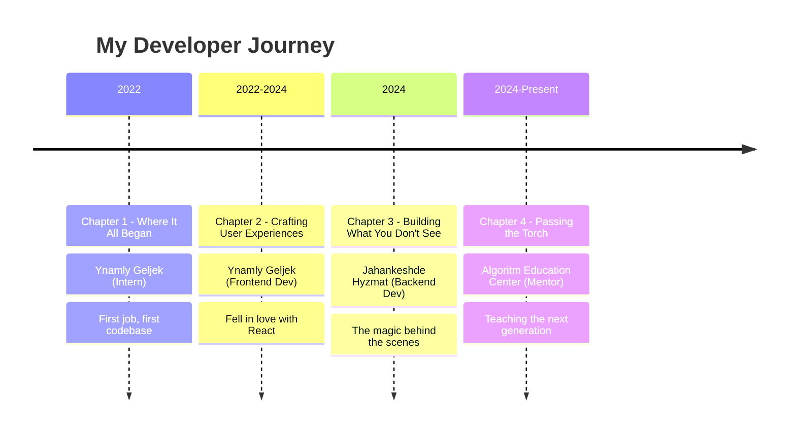

<div align="center">


<br/>

[](mailto:seydi.charyev@gmail.com)
[](https://linkedin.com/in/seydi-charyyev)
[](https://theseydicharyyev.github.io/portfolio/)

</div>


##  More Than Just Code

```typescript
const seydi = {
    location: "Mary, Turkmenistan",
    role: "Fullstack Engineer & Mobile Developer",
    mission: "Making technology accessible to everyone",

    journey: {
        started: "C++ and Delphi",
        now: "React and Flutter",
        teaching: "Next generation of developers"
    },

    motto: "Code is just a tool — the real magic happens when you solve problems that matter"
};
```


##  What I Work With

### Code Languages

<p align="center">
  <b>The Old School</b>
</p>
<p align="center">
  <a href="https://skillicons.dev">
    
  </a>
</p>

<p align="center">
  <b>The New Wave</b>
</p>
<p align="center">
  <a href="https://skillicons.dev">
    
  </a>
</p>

### Building the Web

<p align="center">
  <b>What You See</b>
</p>
<p align="center">
  <a href="https://skillicons.dev">
    
  </a>
</p>

<p align="center">
  <b>What You Don't</b>
</p>
<p align="center">
  <a href="https://skillicons.dev">
    
  </a>
</p>

### Mobile Craft

<p align="center">
  <a href="https://skillicons.dev">
    
  </a>
</p>

### Data Storage

<p align="center">
  <a href="https://skillicons.dev">
    
  </a>
</p>

### The Rest of the Toolkit

<p align="center">
  <a href="https://skillicons.dev">
    
  </a>
</p>


##  The Path So Far

<div align="center">



</div>


##  GitHub Activity

<div align="center">


<br/><br/>


<br/>


<br/>


</div>

<br/>

<div align="center">
  <picture>
    <source media="(prefers-color-scheme: dark)" srcset="https://raw.githubusercontent.com/TheSeydiCharyyev/TheSeydiCharyyev/output/github-snake-dark.svg" />
    <source media="(prefers-color-scheme: light)" srcset="https://raw.githubusercontent.com/TheSeydiCharyyev/TheSeydiCharyyev/output/github-snake.svg" />
    
  </picture>
</div>


##  Not Just Programming Languages

<div align="center">

|  |  |  |  |  |  |
|:---:|:---:|:---:|:---:|:---:|:---:|
| **Turkmen** | **Russian** | **English** | **German** | **French** | **Chinese** |
| Native | C1 | B2 | A2 | A2 | HSK 2 |
| *Where it all started* | *Work & thinking* | *Code & docs* | *Doors to Europe* | *Elegance* | *1.4B friends* |

</div>


<div align="center">

##  Got an Idea? Let's Make It Real


<br/><br/>

[](mailto:seydi.charyev@gmail.com)
[](https://linkedin.com/in/seydi-charyyev)
[](https://leetcode.com/TheSeydiCharyyev)

<br/>

### *"I just want to be successful enough to help people"*

</div>


