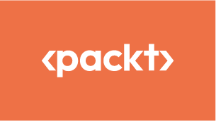

  
About me

   

### Hey, I'm Seydi

**Full Stack JavaScript Engineer & React Native Developer from Turkmenistan 🇹🇲**

- Full stack web development with modern JS/TS
- Cross-platform mobile apps with React Native & Expo
- Open Source Contributor across JS, TS and browser engine projects
- Creating tools for the Turkmen-speaking community
- I just want to be successful enough to help people.

 

  
Projects

   

<h3>Ykjam Terjime</h3>

Turkmen phrasebook & translator with AI-powered translations and text-to-speech support.

  <code>React Native</code>
  <code>TypeScript</code>
  <code>Expo</code>
  <code>Gemini AI</code>

  
  
  
  
  

  &nbsp;

  
Github Stats

   

<table align="center">
  <tr border="none">
    <td width="50%" align="center">
      
        
      
    </td>
    <td width="50%" align="center">
      
    </td>
  </tr>
</table>

  
What I Work With

   

<table>
  <tr>
    <td align="right" valign="top"><strong>Languages</strong></td>
    <td>
      
      
      
      
      
    </td>
  </tr>
  <tr>
    <td align="right" valign="top"><strong>Frontend</strong></td>
    <td>
      
      
      
      
      
      
    </td>
  </tr>
  <tr>
    <td align="right" valign="top"><strong>Backend</strong></td>
    <td>
      
      
      
      
      
      
      
      
    </td>
  </tr>
  <tr>
    <td align="right" valign="top"><strong>Mobile</strong></td>
    <td>
      
      
      
      
    </td>
  </tr>
  <tr>
    <td align="right" valign="top"><strong>Styling &amp; UI</strong></td>
    <td>
      
      
      
      
      
      
    </td>
  </tr>
  <tr>
    <td align="right" valign="top"><strong>Databases</strong></td>
    <td>
      
      
      
      
      
      
      
    </td>
  </tr>
  <tr>
    <td align="right" valign="top"><strong>DevOps &amp; Cloud</strong></td>
    <td>
      
      
      
      
      
      
      
      
      
      
      
      
      
      
      
    </td>
  </tr>
  <tr>
    <td align="right" valign="top"><strong>Build Tools</strong></td>
    <td>
      
      
      
    </td>
  </tr>
  <tr>
    <td align="right" valign="top"><strong>Testing</strong></td>
    <td>
      
      
      
      
      
      
    </td>
  </tr>
  <tr>
    <td align="right" valign="top"><strong>State, Data &amp; Forms</strong></td>
    <td>
      
      
      
      
      
      
      
      
    </td>
  </tr>
  <tr>
    <td align="right" valign="top"><strong>Design</strong></td>
    <td>
      
      
    </td>
  </tr>
  <tr>
    <td align="right" valign="top"><strong>Web3 &amp; Blockchain</strong></td>
    <td>
      
      
      
      
      
      
    </td>
  </tr>
</table>

  
Certificates

   

<table>
  <tr>
    <td width="33%" valign="top" align="center">
      
        
      <strong>Microsoft Full-Stack Developer</strong>
       
      Microsoft &middot; Jan 2026
        
      <a href="https://www.coursera.org/account/accomplishments/specialization/BA53MZBEB26P">View certificate</a>
    </td>
    <td width="33%" valign="top" align="center">
      
        
      <strong>IBM Full Stack Software Developer</strong>
       
      IBM &middot; Jan 2026
        
      <a href="https://www.coursera.org/account/accomplishments/specialization/GHZRJSZH8PQW">View certificate</a>
    </td>
    <td width="33%" valign="top" align="center">
      
        
      <strong>IBM Full-Stack JavaScript Developer</strong>
       
      IBM &middot; Jan 2026
        
      <a href="https://www.coursera.org/account/accomplishments/specialization/FGG6Q56CBHNM">View certificate</a>
    </td>
  </tr>
  <tr>
    <td width="33%" valign="top" align="center">
      
        
      <strong>MERN Stack Front To Back: Full Stack React, Redux &amp; Node.js</strong>
       
      Packt &middot; Jan 2026
        
      <a href="https://www.coursera.org/account/accomplishments/specialization/TR5AG0EHZTUT">View certificate</a>
    </td>
    <td width="33%" valign="top" align="center">
      
        
      <strong>IBM JavaScript Backend Developer</strong>
       
      IBM &middot; Jan 2026
        
      <a href="https://www.coursera.org/account/accomplishments/professional-cert/2JD3OW2CZPU1">View certificate</a>
    </td>
    <td width="33%" valign="top" align="center">
      
        
      <strong>Microsoft Back-End Developer</strong>
       
      Microsoft &middot; Jan 2026
        
      <a href="https://www.coursera.org/account/accomplishments/professional-cert/6X8OVTW7WOMP">View certificate</a>
    </td>
  </tr>
  <tr>
    <td width="33%" valign="top" align="center">
      
        
      <strong>IBM Back-End Development</strong>
       
      IBM &middot; Dec 2025
        
      <a href="https://www.coursera.org/account/accomplishments/professional-cert/A6QUCYAFSLYD">View certificate</a>
    </td>
    <td width="33%" valign="top" align="center">
      
        
      <strong>Meta Back-End Developer</strong>
       
      Meta &middot; Dec 2025
        
      <a href="https://www.coursera.org/account/accomplishments/professional-cert/ZUQQE38VBPVS">View certificate</a>
    </td>
    <td width="33%" valign="top" align="center">
      
        
      <strong>Meta Full Stack Developer: Front-End &amp; Back-End from Scratch</strong>
       
      Meta &middot; Dec 2025
        
      <a href="https://www.coursera.org/account/accomplishments/specialization/QGPE20YYUIYU">View certificate</a>
    </td>
  </tr>
  <tr>
    <td width="33%" valign="top" align="center">
      
        
      <strong>Full-Stack Engineer</strong>
       
      Codecademy &middot; Nov 2025
        
      <a href="https://www.codecademy.com/profiles/SeydiCharyyev/certificates/ffd0f42cce1a44e9a0108b365047a0a6">View certificate</a>
    </td>
    <td width="33%" valign="top" align="center">
      
        
      <strong>Back-End Engineer</strong>
       
      Codecademy &middot; Nov 2025
        
      <a href="https://www.codecademy.com/profiles/SeydiCharyyev/certificates/810f53d14de24b938cc13c7c2af1e686">View certificate</a>
    </td>
    <td width="33%" valign="top" align="center">
      
        
      <strong>Software Engineering</strong>
       
      HKUST &middot; Nov 2025
        
      <a href="https://www.coursera.org/account/accomplishments/specialization/HZKJIPNXX4MC">View certificate</a>
    </td>
  </tr>
  <tr>
    <td width="33%" valign="top" align="center">
      
        
      <strong>Front-End Engineer</strong>
       
      Codecademy &middot; Nov 2025
        
      <a href="https://www.codecademy.com/profiles/SeydiCharyyev/certificates/2682884a0719474f96407efe432fdd87">View certificate</a>
    </td>
    <td width="33%" valign="top" align="center">
      
        
      <strong>Microsoft UX Design</strong>
       
      Microsoft &middot; Sep 2025
        
      <a href="https://www.coursera.org/account/accomplishments/professional-cert/WZG0BJ6AZ5IB">View certificate</a>
    </td>
    <td width="33%" valign="top" align="center">
      
        
      <strong>Microsoft Front-End Developer</strong>
       
      Microsoft &middot; Jul 2025
        
      <a href="https://www.coursera.org/account/accomplishments/professional-cert/UUFZBRH8QG6Y">View certificate</a>
    </td>
  </tr>
  <tr>
    <td width="33%" valign="top" align="center">
      
        
      <strong>IBM Front-End Developer</strong>
       
      IBM &middot; Jun 2025
        
      <a href="https://www.coursera.org/account/accomplishments/professional-cert/Q7GWJUQ4GCN2">View certificate</a>
    </td>
    <td width="33%" valign="top" align="center">
      
        
      <strong>Meta Front-End Developer</strong>
       
      Meta &middot; Jun 2025
        
      <a href="https://www.coursera.org/account/accomplishments/professional-cert/9P5MCCUGRSEB">View certificate</a>
    </td>
    <td width="33%" valign="top" align="center">
      
        
      <strong>Meta React</strong>
       
      Meta &middot; Jun 2025
        
      <a href="https://www.coursera.org/account/accomplishments/specialization/E9H5KJA68HE9">View certificate</a>
    </td>
  </tr>
</table>

  
Coding Profiles

   

<table width="100%">
  <tr>
    <td width="33%" valign="top" align="center">
      
       
      <strong>LeetCode</strong>
       
      <a href="https://leetcode.com/u/seydi_charyyev/">View profile</a>
       
      
    </td>
    <td width="33%" valign="top" align="center">
      
       
      <strong>Codeforces</strong>
       
      <a href="https://codeforces.com/profile/Seydi">View profile</a>
       
      
    </td>
    <td width="33%" valign="top" align="center">
      
       
      <strong>TopCoder</strong>
       
      Coming soon
       
      
    </td>
  </tr>
  <tr>
    <td width="33%" valign="top" align="center">
      
       
      <strong>CodeChef</strong>
       
      Coming soon
    </td>
    <td width="33%" valign="top" align="center">
      
       
      <strong>HackerRank</strong>
       
      Coming soon
    </td>
    <td width="33%" valign="top" align="center">
      
       
      <strong>HackerEarth</strong>
       
      Coming soon
    </td>
  </tr>
  <tr>
    <td width="33%" valign="top" align="center">
      
       
      <strong>CodeSignal</strong>
       
      Coming soon
    </td>
    <td width="33%" valign="top" align="center">
      
       
      <strong>Codewars</strong>
       
      <a href="https://www.codewars.com/users/Seydi%20Charyyev">View profile</a>
    </td>
    <td width="33%" valign="top" align="center">
      
       
      <strong>CodinGame</strong>
       
      Coming soon
    </td>
  </tr>
  <tr>
    <td width="33%" valign="top" align="center">
      
       
      <strong>Exercism</strong>
       
      Coming soon
    </td>
    <td width="33%" valign="top" align="center">
      
       
      <strong>Kaggle</strong>
       
      Coming soon
    </td>
    <td width="33%" valign="top" align="center">
      
       
      <strong>GeeksforGeeks</strong>
       
      Coming soon
    </td>
  </tr>
</table>

  
Half-Life 3

   
  

